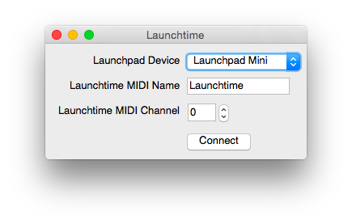

# Description

[](https://travis-ci.org/rclement/launchtime)

**Launchtime** is a multi-platform application allowing the Novation Launchpad
hardware to be used as standalone a step-sequencer synchronized with any
MIDI-enabled host software (DAW).

# Usage

The **Launchtime** app provides a simple graphical user interface allowing to
connect to a Novation Launchpad device and to specify a name and a channel number
for the virtual MIDI port:



# Notes

**Launchtime** uses the RtMidi library to perform MIDI I/O operations, and most
notably opening virtual MIDI ports to communication with other MIDI software.
For now, only the MacOSX and Linux platforms support this feature.

# Compilation

In order to compile **Launchtime**, the Qt4 library is required and the CMake
build system needs to be installed.
After everything is properly is installed, run the following commands:
```
$ mkdir -p build
$ cd build
$ cmake ..
$ make
```

# Deploying the application bundle (MacOSX only)

In order to generate and deploy the application bundle for MacOSX, simply run
the following command:
```
$ macdeployqt Launchtime.app -dmg -no-plugins
```
A `Launchtime.dmg` file will be generated, ready for distribution.

# Contact

Any questions or comments about Launchtime? Let me know at [contact@romainclement.com](mailto:contact@romainclement.com).

# License

The MIT License (MIT)

Copyright (c) 2014 Romain Clement
